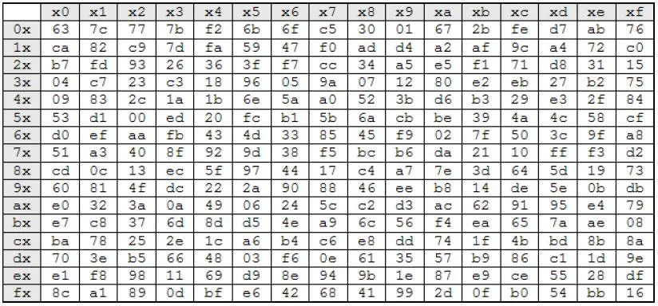

# Side Notes
1. AES differs from Feistel in such way:
    - AES encrypts everything as a block
    - Feistel Encrypts half of them at a time

# AES (Advanced Encryption Standard)
## Field
A Field (Körper) is a set of numbers. It is represented so `K{n}`
1. The Field will not have a number bigger than `n``
2. Numbers in the field are of absolute magnitude
3. Any operation ($+,-,\times,\div$) between 2 Elements $e_1,e_2 \in K$ will result in another number $e_3 \in K$. 
    - If the number $e_3$ is bigger than $n$, then it will be moduloed by $n$

Galois Field (GF) is a special field also known as Finite Field. These fields have a finite countable amount of numbers.

### Mapping 8 Bits to Polynomial Function
In programming, 1 byte has 8 bytes, which has a total of 256 comibinations. Therefore the we use $GF(2^8)$
- We specifically use $GF(2^8)$ instead of $GF(256)$ because there are **8 Bits** with **2 States** per bits
- Instead of seeing the values of the byte as a decimal number, we map the bits to a polynomial function
    - The Polyinomial Function is
    $$
        a_1x^7 + a_2x^6 + a_3x^5 + a_4x^4 + a_5x^3 + a_6x^2 + a_7x^1 + a_8x^0
    $$
    - Notes about the polynomial function
        - $a$: Represent the state of the bits in the registry
            - **NOTE**: In AES, since bits only have 2 states, a can only be 1 or 0 (See more at [multiplication](#multiplication))
        - $x$: Represent the address of the bits in the registry
      
- **Example**
    - **170** = `10101010` and will be mapped to:
        - $1x^7 + 0x^6 + 1x^5 + 0x^4 + 1x^3 + 0x^2 + 1x^1 + 0x^0 $
        - This simplifies to $x^7 + x^5 + x^3 + x$

### Addition and Subtraction
In Programming Field, "Bits" Addition and Subtraction gives the exact same result - They are performed over GF(2) = {0,1}. This means the result will always modulo 2. 
- Results in 0:
    1. 1 - 1 = 0
    2. 1 + 1 = 0
    3. 0 - 0 = 0
    4. 0 + 0 = 0
- Results in 1:
    1. 1 + 0 = 1
    2. 1 - 0 = 1
    3. 0 + 1 = 1
    4. 0 - 1 = 1

Since the result is always 0 if A = B and 1 if A $\ne$ B, we can say that all Addition and Subtraction under GF{2} is performed by XOR operation.

### Multiplication
In Multiplication, we first do normal polynomial multiplication. We have to remember the following rule:
- **Product Rule**: $x^a \times x^b = x^{a+b}$
- **Duplicates cancels out**: If there is an addition, they cancel each other out due to GF(2). (See [above](#addition-and-subtraction))
- **AES Irreducible Polynomial**: $P(x) = x^8 + x^4 + x^3 + x + 1$
    - P(x) is the "Prime Number" for AES to use as modulo, to keep the final multipied Polynomial Function below $x^7$
    - $x^4$,$x^3$,$x$ are chosen because they are easy to calculate using bits shifting or XOR

In Polynomial Multiplication, there are 2 phases:
1. **Multiplication Phase**: Simply multiply the two polynomial
2. **Modulo Reduction with P(x)**: If there are any part of the results that are $> x^7$, you have to modulo it with $P(x)$.
    1. Multiply $P(x)$ with $x^n$ so that the largest factor here matches the largest factor in the result, and add them together (*Hence canceling it out*)
#### Example

---
##### Multiplication Phase
- Byte A: `10000111` $\rightarrow$ $x^7 + x^2 + x + 1$
- Byte B: `10101010` $\rightarrow$ $x^7 + x^5 + x^3 + x$

The product of A $\times$ B is: $(x^7 + x^2 + x + 1) \cdot (x^7 + x^5 + x^3 + x)$

Which results in:
$$x^{14} + x^{12} + x^{10} + x^9 + x^8 + x^8 + x^7 + x^7 + x^6 + x^5 + x^5 + x^4 + x^3 + x^3 + x^2 + x$$

Cancelling out the duplicates $x^8$, $x^7$, $x^5$, $x^3$, leaving behind the final equation of 
$$x^{14} + x^{12} + x^{10} + x^9 + x^6 + x^4 + x^2 + x$$

Since the numbers $x^{14}$,$x^{12}$,$x^{10}$,$x^9$ are bigger than $x^7$, you have to modulo it by $P(x)$ in the reduction phase

---
##### Reduction Phase

|Curent|Highest Factor|Factor needed for $P(x)$|$P(x)$ multiplied| XOR $P(x)$ and Current|
|:---:|:---:|:---:|:---:|---:|
|$x^{14} + x^{12} + x^{10} + x^9 + x^6 + x^4 + x^2 + x$|$x^{14}$|$x^6$|$\begin{array}{lr}& x^8+x^4+x^3+x+1 \\ \times & x^6 \\\hline & x^{14}+x^{10}+x^9+x^7+x^6 \end{array}$|$\begin{array}{cr} & x^{14} + x^{12} + x^{10} + x^9 + x^6 + x^4 + x^2 + x \\ \oplus & x^{14}+x^{10}+x^9+x^7+x^6 \\\hline & x^{12} + x^7 + x^4 + x^2 + x \end{array}$|
|$x^{12} + x^7 + x^4 + x^2 + x$|$x^{12}$|$x^4$|$\begin{array}{lr}& x^8+x^4+x^3+x+1 \\ \times & x^4 \\\hline & x^{12}+x^8+x^7+x^5+x^4\end{array}$|$\begin{array}{cr} & x^{12} + x^7 + x^4 + x^2 + x \\ \oplus &  x^{12}+x^8+x^7+x^5+x^4 \\\hline & x^8+x^5+x^2+x\end{array}$|
|$x^8+x^5+x^2+x$|$x^8$|1|$x^8+x^4+x^3+x+1$|$\begin{array}{cr}& x^8+x^5+x^2+x \\ \oplus & x^8+x^4+x^3+x+1\\\hline & x^5+x^4+x^3+x^2+1\end{array}$|

The final answer after modulo from P(x) is: $x^5+x^4+x^3+x^2+1$
- This converts to `00111101`

### Divison
The purpose of Divison is to find the mathematical inverse of A such that:
$$A(x) \cdot A^{-1}(x) \equiv 1 \pmod{P(x)}$$

Because division is extremely expensive, AES Algorithm **NEVER** perform division "by hand".

Instead, algorith uses a "Lookup table" call Substitution Box (S-Boxing)

#### How it works
- 1 Byte = 2 Nibbles = 8 Bits
    - Each Nibble = 4 Bits
        - Left Half: Most Significant Nibble
        - Right Half: Least Significant Nibble
    - 4 Bits also represents 16 different combination
        - A Nibble can be represented as a Hexadecimal digit
            - Each Byte can be represented as a two digit Hexadecimal number `LR`
            - $L$ represents the row
            - $R$ represents the columns
- Using the sBox(L,R), this returns the inverse value

#### Steps
1. **Determine Left and Right Nibbles in Hexadecimal**
2. **Lookup Table using sBox($L$,$R$)**
3. **Unwind inverse Hexadecimal back into bits**

#### Example
- Give: `10110011`

1. **Determine Left and Right Nibbles in Hexadecimal**
    - $L$ = `1011` = `B`
    - $R$ = `0011` = `3`
2. **Lookup Table using sBox($L$,$R$)**
    - We are looking for cell (`B`,`3`)
        - The inverse is `6D`
3. **Unwind inverse into bits**
    - `6` = `0110`
    - `D` = `1101`
    - Concatentate `6D` $\rightarrow$ `01101101`

Therefore the inverse of `10110011` is `01101101`

## How AES Works
AES is an encryption algorithm that encrypts data in 128 bits at a time.
1. Any less than that, and the data needs ot be padded
2. Any more than that, and a strategy (Operation Mode) for chaining needs to be decided

Since data are stored in a 128 bits block, this means that data are stored in 16 bytes ($\frac{128}{8\text{ bits}} = 16\text{ Bytes}$)
- There are 128 bits in a block
- There are 16 Bytes, each containing 8 bits
- The 16 Bytes are built into a $4\times4$ array

<table style="margin: 0 auto; border-collapse: collapse; text-align: center; font-family: sans-serif; width: 100%; max-width: 600px;">
  <thead>
    <tr style="">
      <th style="border: 2px solid #333; padding: 10px;"></th>
      <th style="border: 2px solid #333; padding: 10px;">Column 0</th>
      <th style="border: 2px solid #333; padding: 10px;">Column 1</th>
      <th style="border: 2px solid #333; padding: 10px;">Column 2</th>
      <th style="border: 2px solid #333; padding: 10px;">Column 3</th>
    </tr>
  </thead>
  <tbody>
    <tr>
      <td style="border: 2px solid #333; padding: 10px; font-weight: bold; ">Row 0</td>
      <td style="border: 2px solid #333; padding: 10px;">Byte 0 <small>(bits 1-8)</small></td>
      <td style="border: 2px solid #333; padding: 10px;">Byte 4 <small>(bits 33-40)</small></td>
      <td style="border: 2px solid #333; padding: 10px;">Byte 8 <small>(bits 65-72)</small></td>
      <td style="border: 2px solid #333; padding: 10px;">Byte 12 <small>(bits 97-104)</small></td>
    </tr>
    <tr>
      <td style="border: 2px solid #333; padding: 10px; font-weight: bold; ">Row 1</td>
      <td style="border: 2px solid #333; padding: 10px;">Byte 1 <small>(bits 9-16)</small></td>
      <td style="border: 2px solid #333; padding: 10px;">Byte 5 <small>(bits 41-48)</small></td>
      <td style="border: 2px solid #333; padding: 10px;">Byte 9 <small>(bits 73-80)</small></td>
      <td style="border: 2px solid #333; padding: 10px;">Byte 13 <small>(bits 105-112)</small></td>
    </tr>
    <tr>
      <td style="border: 2px solid #333; padding: 10px; font-weight: bold; ">Row 2</td>
      <td style="border: 2px solid #333; padding: 10px;">Byte 2 <small>(bits 17-24)</small></td>
      <td style="border: 2px solid #333; padding: 10px;">Byte 6 <small>(bits 49-56)</small></td>
      <td style="border: 2px solid #333; padding: 10px;">Byte 10 <small>(bits 81-88)</small></td>
      <td style="border: 2px solid #333; padding: 10px;">Byte 14 <small>(bits 113-120)</small></td>
    </tr>
    <tr>
      <td style="border: 2px solid #333; padding: 10px; font-weight: bold; ">Row 3</td>
      <td style="border: 2px solid #333; padding: 10px;">Byte 3 <small>(bits 25-32)</small></td>
      <td style="border: 2px solid #333; padding: 10px;">Byte 7 <small>(bits 57-64)</small></td>
      <td style="border: 2px solid #333; padding: 10px;">Byte 11 <small>(bits 89-96)</small></td>
      <td style="border: 2px solid #333; padding: 10px;">Byte 15 <small>(bits 121-128)</small></td>
    </tr>
  </tbody>
</table>

<i>State Array</i>

### Confusion and Diffusion
#### Confusion
The purpose of confusion is to make the relationship between the key and the ciphertext hard to understand.
- This means to break the logic, or introduce one that is so complicated, the patterns are hard to exploit
- Confusion is repeatable (to ensure decryption possibility). The goal is to make pattern unidentifiable
    - Simple Caesar Cipher: Repeatable, pattern recognisable
        - `Common` $\rightarrow$ `Maggax` 
            - `C`: `M`
            - `o`: `a`
            - `m`: `g`
            - `n`: `x`
    - Confusion example:
        - `Common` $\rightarrow$ `Edlwxu` 
            - Uses a fixed substitution table that appears random
            - In AES128 (Advanced Encryption Standard), this is done using an S-box
                - The S-box is constructed using:
                    - Multiplicative inverse in Galois Field
                    - Followed by a fixed bit-mixing transformation
                - At first glance, the mapping has no obvious pattern, making it difficult to relate input, key, and output, therefore fulfilling `making the relationship between the key and the ciphertext hard to understand.`
        
#### Diffusion
The purpose of diffusion is to spread the influence of each part of the plaintext across many parts of the ciphertext. This ensures that patterns in the plaintext are hidden in the ciphertext.
- This means that one change in the letter of the plaintext affects every character in the output ciphertext
    - Simple Caesar Cipher: Repeatable, pattern recognisable
        - `Common` $\rightarrow$ `Maggax` 
            - `C`: `M`
            - `o`: `a`
            - `m`: `g`
            - `n`: `x`
    - Diffusion example:
        - Imagine a fake rule:
            - C affects positions 1, 3, 5
            - o affects positions 2, 4, 6
            - m affects positions 1, 2, 3
            - n affects positions 4, 5, 6

#### Difference
- Confusion aims to convert plaintext into something unrecognisable
    - Linear changes plaintext doesn't map nicely to the ciphertext. This makes the mathematical encryption algorithm (Pattern) unidentifiable
        - Use S-Box Lookup 
- Diffusion aims to shuffle each the position of the plaintext
    - To make the diffusion process stronger, changes to one element in the plaintext changes the position of all elements in the ciphertext, spreading its influence.
### Flow
In AES Round function, we can repeat it as many time as needed. But mathematically the most optimal is 10 times for 128bits. This is a sweet spot
- Too little: Pattern can be broken through and recognisable
- Too much: Already hard to crack, waste of resources.

1. Setup Phase
    - **Load State Array**: Initial 128 bits are loaded into a $4 \times 4$ State
    - **Key Expansion**: Standard AES(128) requires 11 Roundkeys to be precomputed
        - Note that roundkeys are always used once only
    - **Initial XOR Roundkey Transformation**: State will be XORed with the 0th Roundkey
        - $State[row_i,col_i] \oplus Roundkey[row_i,col_i]$
2. AES Round Function
    - In this phase, the State array will go through the following 4 function **9 TIMES**.
        1. SubBytes: (Confusion) Performs a non-linear byte substitution using the S-Box
        2. ShiftRows: (Diffusion) Cyclically shifts the last three rows of the state
        3. MixColumn: (Diffusion) Multiplies each column by a fixed polynomial in $GF(2^8)$
        4. XOR RoundKey Transformation: (Key Binding) Applies a bitwise XOR between the current State and the Round Key to bind the data to the secret key
    - When doing so, we use a for loop of (let i = 1; i < 10; i++)
        - Because 0th roundkey is used in initial phase, we use 1 to track roundkey and current round.
3. Final AES
    - In this phase, we peform the AES Round Function, but less Mix Column.
        - MixColumn only becomes helpful if it is proceeded by a non-linear step like SubBytes()
    - The following functions will be executed in the final round:
        1. SubBytes
        2. ShiftRow
        3. XOR Roundkey Transformation
4. Unload State: The State is now fully encrypted

#### Internal functions
- **$GF(2^8)$**: Note that $GF(2^8)$ refers to:
    - Every element has 2 states: 1 or 0. 
        - Therefore every element is mod 2
    - There are 8 elements, matching the 8 bits
- **$P(x)$**: Engineered to be $x^8+x^4+x^3+x+1$
- **Byte representation**: Every byte is represented by 2 nibbles, each nibble is 4 bits == 1 Hexadecimal digit 
---
##### **SubBytes(state) - Confusion**
The most math heavy function. Since this is the confusion part, it requires S-Box Lookup to find Inverse.
- We take the first nibble as the row, and the second nibble as the column

Why we use S-Box Lookup lookup:
1. Instead of computing it ourselves, the runtime is $O(n^2)$ or $O(n^3)$ depending on the algorithm used
    - S-Box Lookup is simply a look for cordinate x and y,therefore the time complexity is $O(1)$
2. S-Box Lookup maintain consistency in case of any mathematical calculation error
3. SBox has a constant time, so it prevents attack based on CPU timing.
---

##### **ShiftRow(state) - Diffusion**
The most simple function. It moves the $4x4$ Bytes so:
- Row 0: Nothing happens
- Row 1: All bytes in this row moves to the left by 1
- Row 2: All bytes in this row moves to the left by 2
- Row 3: All bytes in this row moves to the left by 3

---
##### **MixColumn(state) - Diffusion**
This function requires the usage of a **Zirkulante Matrix**:

$$\begin{bmatrix}
02 & 03 & 01 & 01 \\
01 & 02 & 03 & 01 \\
01 & 01 & 02 & 03 \\
03 & 01 & 01 & 02
\end{bmatrix}$$

<i>Zirkulante Matrix</i>

---
**1. Splitting State into Columns**
- Our current state looks like this
$$S = \begin{bmatrix}
S_{0,0} & S_{0,1} & S_{0,2} & S_{0,3} \\
S_{1,0} & S_{1,1} & S_{1,2} & S_{1,3} \\
S_{2,0} & S_{2,1} & S_{2,2} & S_{2,3} \\
S_{3,0} & S_{3,1} & S_{3,2} & S_{3,3}
\end{bmatrix}$$
- Therefore we can split our state into 4 columns
$$
S_0 = \begin{bmatrix}S_{0,0}\\S_{1,0}\\S_{2,0}\\S_{3,0}\end{bmatrix},
S_1 = \begin{bmatrix}S_{0,1}\\S_{1,1}\\S_{2,1}\\S_{3,1}\end{bmatrix},
S_2 = \begin{bmatrix}S_{0,2}\\S_{1,2}\\S_{2,2}\\S_{3,2}\end{bmatrix},
S_3 = \begin{bmatrix}S_{0,3}\\S_{1,3}\\S_{2,3}\\S_{3,3}\end{bmatrix}
$$

**2. Matrix Multiplication**
- For each of the column, we perform a matrix multiplication with the Zirkulante Matrix

$$
\begin{bmatrix}
02 & 03 & 01 & 01 \\
01 & 02 & 03 & 01 \\
01 & 01 & 02 & 03 \\
03 & 01 & 01 & 02
\end{bmatrix}

\times

\begin{bmatrix}S_{0,c}\\S_{1,c}\\S_{2,c}\\S_{3,c}\end{bmatrix}

=

\begin{bmatrix}S´_{0,c}\\S´_{1,c}\\S´_{2,c}\\S´_{3,c}\end{bmatrix}
$$

- This new value is the new value of the column.

**Why is this Distribution**

In MixColumns (Diffusion), one byte's value is used to calculate four different output bytes.

Look at the first line of the matrix math: 
- $S'_{0,c} = (02 \cdot S_{0,c}) \oplus (03 \cdot S_{1,c}) \oplus (01 \cdot S_{2,c}) \oplus (01 \cdot S_{3,c})$
- The value of $S_{0,c}$ is now "bleeding" into $S'_{0,c}$.
- But $S_{0,c}$ is also used to calculate $S'_{1,c}$, $S'_{2,c}$, and $S'_{3,c}$ in the subsequent rows.

##### **AddRoundKey(State, Roundkey)**
This part of the process requires a roundkey.
1. Initially, before any encryption happens, the computer creates a 1408 bit long Key.
2. This key is divided into 11 equal sizes of 128 bits blocks
    - This is for the first initial XOR, 9 XOR loop, and the final XOR at the end
3. These 128 bits are turned into 16 equal sizes of 8 bits, building a $4\times 4$ array
4. Each of these are the roundkey used in the AddRoundKey process

Adding Roundkeys is doing an XOR operation on the state with the matching roundkey
$$
\begin{bmatrix}
S_{0,0} & S_{0,1} & S_{0,2} & S_{0,3} \\
S_{1,0} & S_{1,1} & S_{1,2} & S_{1,3} \\
S_{2,0} & S_{2,1} & S_{2,2} & S_{2,3} \\
S_{3,0} & S_{3,1} & S_{3,2} & S_{3,3}
\end{bmatrix}

\oplus

\begin{bmatrix}
R^n_{0,0} & R^n_{0,1} & R^n_{0,2} & R^n_{0,3} \\
R^n_{1,0} & R^n_{1,1} & R^n_{1,2} & R^n_{1,3} \\
R^n_{2,0} & R^n_{2,1} & R^n_{2,2} & R^n_{2,3} \\
R^n_{3,0} & R^n_{3,1} & R^n_{3,2} & R^n_{3,3}
\end{bmatrix}
$$

Let's take a look at the position (0,0)  Assuming that S0,0 = 11001100 and Rn0,0 is 10101010

$$
S_{0,0} \oplus R^n_{0,0} \\
\downarrow\\
11001100 \oplus 10101010 = 01100110
$$

Repeat this step for the rest

### Mode of Operation
Mode of Operation is the type of strategy chosen when the data you are trying to encrypt is more than 128 bits long.

There are three types of Operation, each of them involving splitting the data into 128 bits long Blocks:
1. Electronic Block Chaining
2. Cipher Block Chaining
3. Output Feedback

Note:
- **Initialization Vector (IV)**: IV is a public, random 128 bits starting value.

#### Electronic Code Book
After splitting the Plaintext into 128 Bits Blocks, tt performs the AES encryption, treating each of them exactly the same.

This causes repeated pattern to be identifiable, and is not secure.

---

#### Cipher Block Chaining
Before performing an AES encrpytion, this operation does 1 extra step.

It XORs the current Plaintext with the previous Ciphertext.
- Since the first round does not have a previous Ciphertext, it will XOR with IV.

---

#### Output Feedback
In OFB mode, your plaintext never goes into the AES Cipher. Instead:
1. You put the IV to your AES cipher to get a "$Keysteam_1$". This keystream XOR with your plaintext to generate your ciphertext
2. For the next block of plaintext, you put the "$Keysteam_1$" into the AES cipher to get "$Keysteam_2$", which is used to XOR plaintext to generate the next ciphertext

Essentially:
|Input to AES|Output|Target Block|Outcome|
|---|---|---|---|
|IV|$Keystream_1$|$Block_1$|$Cipher_1 = Block_1 \oplus Keystream_1$|
|$Keystream_1$|$Keystream_2$|$Block_2$|$Cipher_2 = Block_2 \oplus Keystream_2$|
|$Keystream_2$|$Keystream_3$|$Block_3$|$Cipher_3 = Block_3 \oplus Keystream_3$|
|---|---|---|---|
|$Keystream_{n-1}$|$Keystream_n$|$Block_n$|$Cipher_n = Block_n \oplus Keystream_n$|