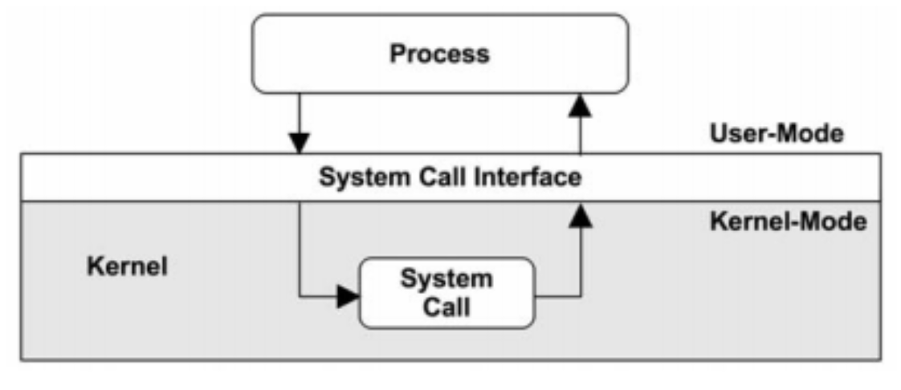

# Focus
The focus of the lecture:
1. Security of classic Desktop PC and Servers
2. Microsoft windows and Linux as examples
3. Focus on attack through malware

# Important Knowledge
**Abstraction**: Creation of a blackbox *layer**, and exposing predetermined function as interface
- The layers refers to architectural layers like OSI, Ring, etc.

# Operating System
**Users**: Within each Operating System, multiple users can be created. An OS should then:
1. Keep Users data separated
2. Run them in isolation
3. Prevent access of each other

**Software**: A badly written software with direct access to the hardware can cause several issue:
1. It could override Kernel's code for simple features, like what a click should do. This makes click impossible
2. It could override CPU to do list, sending it into a infinite loop

Thus a Permission Model (Ring Model) is created to manage what kind of permission a software has.

## Ring Privileges Model
The Ring Model is a hierarchical hardware architecture that provides layered protection by restricting the CPU instructions a program/application can execute based on its assigned privilege level

The lower number, the more access an App's coding has to directly manipulate the hardware.

| Ring Level | Name of Level          | What it does  |
|------------|------------------------|---------------|
| -3         | Management Engine      ||
| -2         | System Management Mode ||
| -1         | **Hypervisor***        ||
| 0          | **Kernel***            ||
| 1          | Driver Layer           ||
| 2          | Service Layer          ||
| 3          | **User Mode***         ||
*Bold Levels are the ones relevant to this module**

### History of Ring Model*
_This is not part of the notes, and are additional information I found_

During the creation of x86 architecture, the engineers decided that Kernel would be the core (Highest permission)
* Analogous to the structure of the earth
  - Core: Kernel
  - Space: User
  - Rings closer to the surface has lesser permission for security
  - Ring 3: Exposed to the User

As technology advanced, engineers needed layers to control the Kernel (e.g., for Virtual Machines).
* **The Problem:** Changing the scale to 0-6 would break all existing software that expects the Kernel to be at **0**.
* **The Solution:** Keep **0** as the anchor and go into negative values for "deeper" privilege.
    * **Ring -1:** Hypervisor (Virtualization).
    * **Ring -2:** SMM (Hardware Power/Thermal).
    * **Ring -3:** Management Engine (Independent Hardware Control).

Responsibilities and Important Layers
- Rings **-3 to -1**: are "Invisible" to the kernel and controls it.
- Kernel: Directs everything that happens within an Operating System.
- Ring **3**: is the exposed Interface where humans works with.

## Hypervisors
The Hypervisor (Virtual Machine Monitor) is a software layer. 
- It intercepts signals from the Kernel to the hardware 
- It determines which part of the hardware the Kernel's signal goes to
- This allows the hardware to be compartmentalized for multiple Kernels, thus allowing multiple Virtual Machines in one hardware.

> Hypervisors allows existence of multiple OS in one hardware

## Kernel Layer and User Layer
In this part of the note:
* Ring 3: will be a stand in for "Application" or "Program" that the user is using
* Ring 0: The Kernel
### Context
_The context is not relevant to the exams_

Disadvantages of switching layers
1. Switching between layers performs a context switch function, which includes clearing caches and registers. This waste a lot of time
2. The 4 Ring model was designed specifically for x86 chips. Apple ARM Chips uses only User and Kernel
   - Maintaining 4 Layer code for all OS is a disaster
   - Eventually flatten to just two

Drivers are eventually placed in either Ring 0 (Max Speed) or Ring 3 (Max Safety)
- Drivers are code that allows computer to understand a new hardware, and what input it gives.
  - Example: A push on the left button of the mouse is not the same as the right button. A driver translate that left button click to code.

### Differences
|                           Kernel                            |                            User                             |
|:-----------------------------------------------------------:|:-----------------------------------------------------------:|
|                  Direct Access to Hardware                  |                    No Access to Hardware                    |
| Unrestricted Access to<br>- All Processes<br>- All Memories | Unrestricted Access to<br>- Own Processes<br>- Own Memories |

### Communication Process
The communication between the user and kernel layer is exactly the same as other abstraction layers.


**Example**

| Step | Entity        | Action                                                                                                              |
|------|---------------|---------------------------------------------------------------------------------------------------------------------|
| 1.   | App           | Calculate coordinates and physics                                                                                   |
| 2.   | App → Kernel  | App requires hardware access, but does not have permission. So it sends the data and to-dos to the kernel to manage |
| 3.   | Kernel → GPU  | Kernel schedules the task to GPU                                                                                    |
| 4.   | GPU           | GPU recieves the task and calculate colors, pixel, etc, based on data recieved                                      |
| 5.   | GPU → Monitor | Hardwares are not part of the Ring Model and talk directly to each other. GPU outputs to Monitor directly           |
|      | Kernel        | During this step, Kerel manages the V-Sync and other stuff                                                          |

#### Program to Kernel
The only interface function that allows Ring 3 to invoke Ring 1 is `System Call`. 

System calls are made always $3 \rightarrow 0$, never $0 \rightarrow 3$

A System call is made whenever Ring 3:
- Needs to CRUD a data in local memory
- Needs to send/recieve data through networks

System calls are _**usually**_ never made directly by the code. Rather, a function in a library is used to handle system calls.
- Reasons match usual requirements of blackboxing
  - Standardized
  - Optimized
  - DRY
  - Translate automatically across various OS
- Linux supports ~300 different types of Syscall
- Windoes support ~700 different types of Syscall

#### Kernel to Program 
_This segment is not relevant to the klausur_
Kernel has multiple ways to talk to a program

1. **Signal**: Force close a program
2. **Interrupt**: A response to the program when it performs an illegal action, like dividing by zero or touching restricted memory.
3. **Callbacks**: The kernel returns the program its requested data

# Linux Security

## Introduction
### Context
A vulnerability within the Driver can lead to complete compromise of the System:
- Most Hardware requires a driver to translate the Electrical signal sent by physical input (Click or button push) into code.
  - Most drivers are written with Ring 3 permission, but some requires direct access to RAM for speed, such as GPU
- Ring 0 drivers has unlimited permission.
  - Although GPU is in charge of only graphics processing, it technically can access everything else
- Hacking into the GPU driver means full access to the computer

### Problem
Most Drivers are written by 3rd Party hardware developers with limited OS experts. This makes them in ITS the weakest link.

## File Permissions
### Users and Group
In Linux, File permission uses the UGO access matrix. These permissions are static.

This is stored as UID and GID in `/etc/passwd`, and authenticated by a password stored in `/etc/shadow`

A `superuser` (aka `root`) is a special user that can access and change everything in a system.

### File Permissions
Each file has three distinct access right:
- Owner
- Group
- Others

There is also 3 distinct access type
- Read R
- Write W
- Execute X

The combination of these three creates an **access matrix**

|             | Owner | Group | Others |
|:------------|:-----:|:-----:|:------:|
| Read (r)    |   -   |   -   |   -    |
| Write (w)   |   -   |   -   |   -    |
| Execute (x) |   -   |   -   |   -    |

The access matrix are represented in a string of 10 characters `- --- --- ---`
1. The first character represents a file type
   * `-` : Regular file type like `.txt`, `.png`, or other executable
   * `d`: A directory/folder
   * `l`: A link
2. The 2-4 character represent the permission of the owner
3. The 5-7 character represent the permission of the group
4. The 8-10 character represent the permission of the others

If the person has permission, there will be a letter. If not, it will be a dash.

You can view the access matrix in terminal using `ls -l`
#### Example
| ReadMe.md   | Owner | Group | Others |
|:------------|:-----:|:-----:|:------:|
| Read (r)    |   X   |   X   |   X    |
| Write (w)   |   X   |   X   |   -    |
| Execute (x) |   X   |   -   |   -    |

1. Since the file is a generic executable, it is `-`
2. Owner can RWX
3. Group can RW
4. Others can R

Therefore, the permission matrix is `-rwxrw-r--`


## Processes
Every Process is uniquely identified by `PID`. Scheduling, memory, and resource management information are contained within a process.

In Linux, Process permission uses the UES access matrix. These permissions are static.
- User ID: The person who started the process.
- Effective UID: The ID used by File permission to check for privileges.
- Saved UID: Used to temporarily "drop" and "restore" privileges.
  - Processes are born with SUID

### Justification/Use Case
Sometimes, your privilege is not enough at the start of a process. For example, changing password in terminal

The folder for password `etc/shadow` is owned by root. User is not allowed to have access to RWX

The solution:

| Step | What is done                                          | UID  | EUID | SUID |
|------|-------------------------------------------------------|:----:|:----:|:----:|
| 1    | User starts the change password process with `passwd` | user |  -   | root |
| 2    | Program starts with root power                        | user | root | root |
| 3    | Perform file permission check against EUID            | user | root | root |
| 4    | Check succeed; Update password                        | user | root | root |
| 5    | Destroys all EUID created in this process             | user |  -   | root |

This allows users to temporarily gain privileges that it otherwise normally do not have.

However, since SUID is usually root, this makes it an attractive target for attack.

## Attacks/Exploits
### TOCTOU Attacks
Time-of-Check, Time-of-Use (TOCTOU) is a security exploit that only affects Linux.
It happens when a program checks if you have permission to do something, but before it actually does it, the situation changes.

**Example**:
1. Time of Check ($t_1$): The program calls access("my_file.txt"). The Kernel says, "Yes, user eden is allowed to write to my_file.txt."
2. The Attack ($t_{attack}$): In the millisecond after the check but before the next step, the attacker quickly deletes my_file.txt and replaces it with a Symbolic Link pointing to `/etc/shadow`.
3. Time of Use ($t_2$): The program calls `fopen("my_file.txt")`. Because it already checked permissions in step 1, it thinks it's safe. It follows the link and accidentally overwrites the system password file.

The Attack must take place between time of check and time of use. This creates a scenario called "Race Condition".

**Why doesn't windows get affected**
- Linux performs the two steps:
  - Check for privileges
    - If the target file (Dummy) contains a Symlink (contains nothing but a text string representing a path to another file or directory), it will check permission for the next file
  - Execution on dummy
    - If symlink to the dummy file is changed, the program will still allow you to execute for the new file
- Windows perform one atomic step:
  - Creates a handle that points to the file, and check for permission
  - If file is changed, kernel still points towards the old file until Handle process is completed

#### Examples

##### Symlinks (File Path Swap)
Attacker somehow manages to gain access as `user` in the terminal. Now he wants to open a restricted file.

1. Attacker creates a dummy file `dummy.txt` and is the Owner.
2. Attacker creates a pointer file `pointer.txt` which contains a symlink to `dummy.txt`
   - `dummy.txt` is a random .txt file that the attacker has RWX privilege
3. The attacker executes a System Utility (like a backup tool or a file-repair tool) that runs with root privileges
   - This high-privilege program calls `access("pointer.txt", W_OK)`  to check `pointer.txt` 
   - Linux sees the symlink in `pointer.txt` and check for permission at `dummy.txt` instead.
   - Linux raise the flag and grants access to the script ($t_1$)
4. The attacker’s background script swaps the symlink: `pointer.txt` $\rightarrow$ `/etc/passwd`.
   - This is the attack ($t_a$)
5. The root program is convince the user has permission to do what he wants to the symlink in `pointer.txt`
   - It calls `open("pointer.txt")`
   - Because the program is `root`, kernel allows it to open `etc/passwd`
   - The program then writes the attacker's data into the password file ($t_2$).

##### File Swap (Script Swap)
Assuming there exists a shell program called `./xxx.sh`, owned by root. Attacker wants to perform a process he normally has no permission

1. Attack runs the `./xxx.sh` command in Terminal
2. Kernel recognizes the `SUID` of the shell program is `root` and starts with `root` privileges.
3. The Interpreter starts ($t_1$), but have not yet executed the `./xxx.sh` file yet
4. The attacker’s script swaps `./xxx.sh` with their own `malicious.sh`, usually by renaming and overriding their file with the `xxx.sh` name
5. Interpreter blindly believes that the file has not be touched and execute the file with `root` privileges
   - Usually `rm -rf` or add/change attacker's privilege setting.

##### Directory swap
Assuming there is a cleanup utility tool that removes content from `tmp/` folder. The attacker's goal is to delete sensitive information from a restricted locations.

1. The cleanup utility runs `rm -r tmp` to recursively remove files from `tmp/`
   - This process always starts from the lowest nested level, assuming `tmp/A/B/C` 
2. It clears everything in `C`
3. The attacker renames `tmp/A` to `tmp/A_old`, and creates `tmp/A` with symlink to `~/whatever path they want`
4. The process goes to `tmp/A` and is redirected via symlink to the target directory. 

#### Countermeasures
File Handle / File Descriptor: An abstract "token" or "reference" given to a program by the OS. Once you have a handle, it points directly to the physical data on the disk, not the name on the folder.

1. **Immutable Bindings**
   - The action is permanently "bound" to the data it is operating on.
   - It is no longer possible to swap the data while the action is in progress.
   - Informatics context: This usually means performing the check and the action atomically.

2. **File Handles**
   - Instead of using the filename, you open the file once and get a Handle (or File Descriptor in Linux).
   - Even if an attacker renames the file or swaps a symlink later, your handle still points to the original physical data you opened.

3. **Don't check permissions yourself with access()**
   - Let the Operating System handle the permission check during the open() call.
   - Why? Using access() creates the "Time-of-Check" gap. Instead, just try to open() the file and catch any errors (e.g., "Permission Denied") if it fails.

4. **Locks**
   - Locks are good for preventing accidental race conditions (like two programs writing to the same file).
   - However: They are not suitable against TOCTOU attacks because an attacker can often ignore or remove the locks.

### Command Injection Attacks
#### Shell Injection
Similar to SQL Injection, the code uses `;` to tell a program to execute the next line.
- The program must take a user input and directly execute it in shell command

Suppose a program runs `ls /users/{variable}` and the malicious input is `bob; rm -rf`.
- The resulting output is `ls /users/bob; rm -rf`.

A common defense to this exploit is to use restrictive shell with `bash -r`. It prevents:
- Using `cd` to change directories.
- Changing environment variables (like `$PATH`).
- Executing commands that contain a `/`.

#### Vulnerable Functions
Focuses on C programming functions that are famous for being dangerous if used incorrectly.
**cat**: Concatenate; Print file content to terminal
- If `cat file1 file2`: Read continuously and print out all as one stream.

##### system(var)
When you write `system(var);` in C, the computer does this:

1. Pauses your C program.
2. Starts a Shell (/bin/sh).
3. Sends the variable as text to that shell.
4. The shell runs the variable and prints the files to your screen.
5. The shell closes, and your C program continues.

```c
char command[100]; // Declare variable command
sprintf(command, "cat %s", user_provided_filename); //concat command with text and another variable
system(command);
```
If the attacker gives the input `file.txt; rm -rf`, system executes `cat file.txt; rm -rf`

##### popen()

"Documents; cat /etc/shadow"
```c
char command[100]; // Declare variable command
sprintf(command, "ls %s", user_provided_filename); //concat command with text and another variable
popen(command);
```
If the attacker gives the input `folder; cat /etc/shadow`, system executes `ls folder; cat /etc/shadow` and gain access to all passwords.

---
### Shared Libraries Attacks
#### How it works
In Linux, a piece of code is written to comply with the "DRY" principle.
- The code lives in a shared library called `libc.so`, reducing memory size
- All programs can reach to this library to execute functions within

Linux also have a feature called "Preloading". 
- This is set by an environment variable "LD_PRELOAD" 
- If it is set to `abc.so`, then it will look at `abc.so` first before `libc.so`
- `abc.so` is the preload, and have higher priority

The problem is first come first served:
- If both `abc.so` and `libc.so` have the same function (exmple: printf)
  - `abc.so`'s function will be loaded first and used

An attacker can write and save a fake library (in this case, `abc.so`)

All together:
1. The attacker notices that their target (victim program) uses function `hello()` from shared library `libc.so`
2. They prepare `hello()` with their own logic in a malicious library `evil.so`
3. They inject the execution environment with `LD_PRELOAD` to point to `evil.so`
4. They run the target program normally which will execute `evil.so.hello()`

#### Countermeasures
- **Path Restriction:** Libraries are restricted to paths defined in `/etc/ld.so.conf`.
- **Centralized Cache:** `ldconfig` manages the library cache to maintain integrity.
- **SUID Protection:** `LD_PRELOAD` is ignored for SUID binaries to prevent root-level hijacking.
- **Restricted Preloading:** Global preloading via `/etc/ld.so.preload` is restricted to the root user.


---
