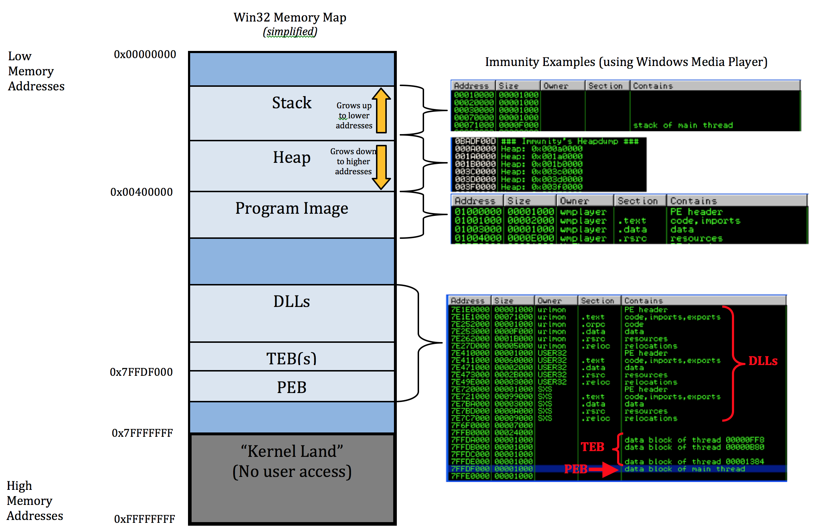

# Windows Security
In this chapter, we will explore the security mechanisms implemented in the Windows operating system, focusing on user authentication and access control.

# Windows User Authentication
## Authentication Process
### Windows Logon (winlogon.exe)
Operates as a protected user process `winlogon.exe` in an isolated desktop environment called Windows Security Desktop.

Here, windows logon is responsible for:
1. Rendering the GUI for user credential input (username and password)
2. Sending the credentials to the Local Security Authority Subsystem (LSA) to verify user credentials and manage user sessions.
3. Launching personal desktop workspace (explorer.exe) upon successful authentication
4. Handling the secure attention sequence (CTRL-ALT-DEL) to prevent credential interception by malicious software

### Local Security Authentication (lsass.exe)
Operates as a protected user process `lsass.exe`. 

It:
1. Maintains internal security policies for the OS, such as what rights each user group has
   - For example, which users can access which files/folders
   - what they can do with them (read/write/execute).
2. Verifies user identities during credential submission (Login screen) using passwords
    1. LSA recieves the credentials from Windows Logon
    2. Local vs Network logon
       - Local logon: LSA verifies the credentials against the local SAM database
       - Network logon: LSA forwards the credentials to a domain controller for verification via Kerberos
3. Creates user tokens upon verification (Access Tokens - Which files can you not/access).
    - Tokens contains User SID and Group SIDs
    - User SID is a unique identifier for the user, while Group SIDs represent the groups the user belongs to.
    - Every program copies and checks this token for access control decisions

## Secure Attention Sequence
A Secure Attention Sequence (SAS) is a hardwired, unblockable key combination reserved by the operating system kernel to guarantee a trusted communication path between the user and the system.

1. The SAS forces the operating system kernel to immediately switch the monitor view away from normal applications.
2. It transitions to the **Windows Security Desktop**, an isolated desktop environment controlled strictly by the system.
3. Because normal user-space applications have zero access to this secure desktop layer, it is physically impossible for malicious software to manipulate, see, or override it.
4. Since only this hardware key sequence can trigger this desktop switch, it serves as absolute proof to the user that the interface is authentic.

### CTRL-ALT-DEL Interception
In Windows, the default SAS is `CTRL-ALT-DEL`.

When pressed, the kernel intercepts the input directly and routes it straight to the trusted **`winlogon.exe`** process, bypassing all regular application chains. 

This design actively blocks credential interception attacks:
* **Keylogger Protection:** Keyloggers run in the standard user desktop session. Because the SAS moves your keyboard input entirely into the isolated Windows Security Desktop, background malware cannot see or log the keystrokes typed into the password field.
* **Fake Login Screen Protection (Phishing Overlays):** Malware running on your normal desktop can create fake full-screen login windows to trick you. However, malware cannot intercept or block `CTRL-ALT-DEL`. Pressing this sequence instantly tears down or bypasses any fake user-space windows, pulling up the true, protected system login GUI instead.

## Authentication Backends
### Local Authentication (SAM Architecture)
The Security Accounts Manager (SAM) is a database that stores local user accounts and their associated hashed passwords on a Windows machine. 

This data is stored in a local hard drive file.

The Process: 
1. You type your password in Windows Logon (winlogon.exe).
2. LSA (lsass.exe) intercepts it and calls the local SAM database.
3. SAM validates the password hash.
4. If correct, SAM hands back your unique identity numbers (User SID and Group SIDs) to LSA so your desktop session can start.

Limitation: Your credentials only exist on that specific computer. You cannot use this account to log into a different PC in the office.

### Domain Authentication (Kerberos Architecture)
In a domain environment, user credentials are not stored locally. 
They are stored on a central machine called a Domain Controller (DC) that runs the Active Directory service.
The Kerberos protocol is the centralized authentication service used by the LSA to connect to DC.

The Process:
1. You type your corporate network password.  
2. LSA uses the Kerberos protocol to securely pack and send your login request to the Domain Controller.  
3. The Domain Controller checks its central database to verify who you are.  #
4. If verified, the Domain Controller passes back your identity details and network tickets across the network to your local LSA process.  

Advantage: Single Sign-On (SSO) - You can sit at any computer connected to the company network, type your password, and access your files instantly because authentication is fully centralized.  

## Tokens
A Token is a digital object created by the kernel that acts as a user's official security pass, containing their Security Identifier (SIDs) and specific privileges

### Child Processes - Inheritance
**Rule**: When a user opens a program, it creates a Child Process. This child process inherits the same Access token as the parent process.

The Desktop is a GUI managed by explorer.exe. Any program opened will instantiate a child process. If your account is blocked from opening a certain file, any program you open is also blocked from opening it while you are logged in. 

---

### Keberos Tickets and Remote Services
In a network, there is a four step Keberos authentication process to access remote services:
1. (Client Request): Your local program (Client) wants to access a remote resource or server on the company network.  
2. (Authentication): The client contacts the central Authentication Service to prove who you are.
3. (Token Request): Once authenticated, the client communicates with the Token Service to receive an official security pass. 
4. (Authorization Code/Ticket): The client receives an Authorization Code / Kerberos Ticket. It uses this ticket to build a network login session and access the remote server securely

---


# Windows Access Control
The Windows OS is completely Object-Oriented. Everything exists as a Object structure featuring a header containing a Security Descriptor specifying its security attributes

Every event will trigger Windows to look through 3 actors to determine the safety of the action:
1. **Subject**: The user or process trying to perform an action (e.g. opening a file, running a program)
2. **Object**: The resource being accessed (e.g. a file, folder, registry key)
3. **The Action**: The specific operation being attempted (e.g. read, write, execute)

For example, if you try to open a file, the Subject is you (the user), the Object is the file, and the Action is "read".
1. The system evaluates whether a specific Operation (read) is allowed for your current Security Context (Your SID and Group SIDs) on that specific Object (the file) by checking the file's Security Descriptor.
2. This verification step is handled directly by a core kernel component called the Security Reference Monitor (SRM). 
3. The SRM executes an internal validation function called SeAccessCheck.
4. If SeAccessCheck confirms validation, it generates and returns an Object-Handle to your program (instead of letting it open only once).
   - The handle is a unique identifier that allows your program to interact with the file without needing to re-compute permissions for every single action.

# Security Context
A Security Context is the combination of a user's unique identity (User SID), their group memberships (Group SIDs) and their special privileges.

This is stored within a secured Kernel Object called an Access Token.

## Access Tokens Usage 
1. Automatic Binding: Every single program (process) or sub-task (thread) that starts up on your computer is automatically given a copy of this badge.  
2. Sharing Rules: By default, every worker thread inside a program shares the exact same badge.  
3. Impersonation: Sometimes, a single worker thread needs to temporarily swap its badge for a different one to perform a specific task (like fetching a file over the network using a different account).

## Data in Access Token
1. User SID: Your personal, unique account number.  
2. Group SIDs: The numbers of all the groups you belong to (like "Administrators").  
3. Privileges: Special administrative settings or "superpowers" that normal users don't have.  
4. Default Permissions: The security rules applied automatically whenever this program creates a brand-new file. 

# Windows 11 Safety Mechanisms
## Boot and Hardware Security
### UEFI secure boot
Secures the bootloader. It ensures that the computer only boots using an OS loader that is signed and trusted by Microsoft, blocking early-stage malware like bootkits

See more details in the Bootkit section [below](#uefi-secure-boot-1).
### Early Launch Antimalware (ELAM)
ELAM is a security feature that loads antivirus software early in the boot process, before most drivers and services start. 

This allows it to detect and block malware that tries to load during startup, such as rootkits and bootkits.
### Device Health Attestation (DHA)
DHA is a security feature that checks the health and integrity of a device. 

If a host machine is infected or tampered with, DHA drops or blocks it from joining a corporate network.
- The digital health check is a unique digital fingerprint (a cryptographic hash), which is generated by the device's hardware and software components. 
- This fingerprint is then sent to a remote attestation service for verification. 
- If the fingerprint matches a known good state, the device is allowed to access the network. 
- If it does not match, access is denied, preventing potentially compromised devices from connecting to sensitive corporate resources.

## Identity and Credential Protection
### Credential Guard
A Credential Guard is a security feature that isolates and protects user credentials in a secure environment called a Virtual Secure Mode (VSM).

isolate sensitive password information (like NTLM hashes and Kerberos tickets) inside a separate container so that even an administrator-level hacker cannot steal them.

## Exploit mitigation
### Content Guard: SmartScreen & Ransomware Protection
#### SmartScreen
SmartScreen is a cloud-based security feature that helps protect users from malicious websites and downloads. 
1. It checks the reputation of websites and files against a constantly updated database of known threats. 
2. If it detects a potential threat, it warns the user before they can proceed, preventing phishing attacks and malware infections

#### Ransomware Protection
Ransomware Protection is a security feature that helps protect users from ransomware attacks.
1. It monitors and blocks unauthorized changes to files and folders, preventing ransomware from encrypting or deleting important data. 
2. It also allows users to specify which folders are protected, giving them control over their data security.

### Environment Isolation: Universal Windows-apps Protection (AppContainer)
When you open an Universal Windows Platform (UWP) Application on Windows, it runs in a sandboxed environment called an AppContainer.

The AppContainer is a highly restricted environment that limits the app's access to system resources and user data.
1. It prevents the app from accessing sensitive files, registry keys, and other system resources without explicit permission.
2. It also restricts the app's ability to communicate with other processes, reducing the risk of malware spreading or stealing data from other applications.

### Memory Exploitation Guard: DEP, ASLR, SEHOP, Heap & Kernel Pool Protections
#### Data Execution Prevention (DEP)
DEP is a security feature that marks certain areas of memory as non-executable, preventing malicious code from running in those regions. This helps protect against buffer overflow attacks and other types of memory-based exploits.

If it detects an attempt to execute code from a non-executable region, it will terminate the process by crashing it, preventing the attack from succeeding.
#### Address Space Layout Randomization (ASLR)
ASLR is a security technique that randomizes the memory addresses used by system and application processes. 

This makes it more difficult for attackers to predict the location of specific functions or data structures, reducing the effectiveness of certain types of exploits, such as return-oriented programming (ROP) attacks.
#### Structured Exception Handler Overwrite Protection (SEHOP)
SEHOP is a security feature that protects against structured exception handler (SEH) overwrite attacks. 

It validates the integrity of the SEH chain to prevent attackers from overwriting exception handlers with malicious code, which can lead to arbitrary code execution.
#### Heap & Kernel Pool Protections
Heap and kernel pool protections are security features that help prevent memory corruption vulnerabilities in the heap and kernel pool. These protections include techniques such as heap metadata integrity checks, pool tagging
### Code Flow Integrity: Control Flow Guard (CFG) & Protected Processes
#### Control Flow Guard (CFG)
CFG is a security feature that helps prevent control flow hijacking attacks by validating indirect function calls at runtime. 

Analyzes your code graph during compilation. It builds a map of all legitimate path destinations and prevents attacks that try to forcefully redirect code away from its original path
It ensures that indirect calls only target valid, expected locations in memory, making it more difficult for attackers to redirect execution flow to malicious code.
#### Protected Processes
Protected Processes is a security feature that restricts access to certain critical system processes, such as antivirus and security software. 

These processes run with elevated privileges and are protected from being tampered with or terminated by other processes, even those with administrative rights. 

This helps ensure the integrity and reliability of security software, making it more difficult for attackers to disable or bypass security measures.

# Process Mitigation
Process Mitigation is a security setting enforced by the OS kernel that restricts a program's behavior to prevent memory exploits.

## View Status (Get-ProcessMitigation)
Windows allows you to use PowerShell to inspect exactly which anti-exploit protections (like DEP, ASLR, or CFG) are active for a program.
First, you must load the required system management tool into your command window:
```powershell
Install-Module -Name ProcessMitigations
```
Once installed, you can retrieve security data using three distinct scopes:
1. By Application Name (Live Memory): Tracks a running program to see its active real-time status.  
    ```powershell
    PowerShellGet-ProcessMitigation -Name notepad.exe -RunningProcesses
    ```
2. By Process ID (PID): Targets a very specific active instance copy using its unique numeric system identifier.
    ```powershell
    PowerShellGet-ProcessMitigation -Id 1304
    ```
3. By Stored Registry Config: Checks what security rules are written down on your hard drive file settings for that app, even if the program is completely closed right now.  
    ```powershell
    PowerShellGet-ProcessMitigation -Name notepad.exe
    ```


## Apply Status (Set-ProcessMitigation)
You can also use PowerShell to turn these security guards on or off depending on your debugging or security needs:

1. Targeted Application Setup: You can apply precise rules to a single executable file. For example, this command forces Notepad to only load files signed by Microsoft, while simultaneously turning off mandatory ASLR scrambling:
    ```powershell
    PowerShellSet-ProcessMitigation -Name Notepad.exe -Enable MicrosoftSignedOnly -Disable MandatoryASLR
   ```
2. Enterprise Mass Deployment: Instead of typing commands for every single app, IT administrators can load an entire pre-configured security blueprint file directly into the operating system.
    ```powershell
    PowerShellSet-ProcessMitigation -PolicyFilePath settings.xml
   ```
3. System-Wide Protection Base: Applies a critical security lock globally across the entire operating system, forcing every single program on the PC to follow the rule.
    ```powershell
    PowerShellSet-ProcessMitigation -System -Enable MicrosoftSignedOnly
   ```
   
# BIOS (Bootkit attacks)
BIOS - Basic Input/Output System, is the outdated firmware motherboard. It is vulnerable to Boot/Rootkit attacks by blindly trusting the boot process and allowing any code in the boot record to run without security checks.

## Boot Process
**Context:**
- **Boot Record**: A tiny, dedicated section at the very beginning of a storage drive or partition that contains crucial startup instructions information for the hardware.
- **Sector**: The smallest physical storage block on a hard drive, traditionally size 512 bytes. A standard boot record (Bootloader) fits entirely inside the very first sector (Sector 0) of a drive or volume.

**The Boot Process:**
1. When you press the power button, the motherboard firmware, the BIOS wakes up. It performs a Power-On Self Test (POST) to check the hardware components (CPU, RAM, etc.) are working.
   - At this point, the system has no idea what an OS is. It just knows how to talk to the hardware and run some basic instructions.
2. After POST, the BIOS looks for a bootloader on the storage device's Sector 0.
   - This contains the Master Boot Record (MBR) which is a small executable code, and contains the list of Volume Boot Records (VBRs) for each partition on the drive.
   - It then look through all the VBR Partitions table to find the active partition, usually the C drive, and jumps to the bootloader code in that partition's VBR.
3. The VBR contains code to find and load the OS Kernel into memory.
4. Finally, the VBR handover control to the OS Kernel (Windows in this case)

This process is completely operated on blind trust - BIOS will run MBR, and MBR will run VBR, and VBR will run the OS Kernel without any security checks.
- This makes the boot process a prime target for malware like bootkits, which can insert themselves into the MBR or VBR to gain control of the system before the OS (where security checks are implemented) even starts.

## Startup Process Infections
There are two type of infections that can occur during the startup process:
1. **Bootkit**: 
    - A bootkit changes the instructions to the physical hardware on how to start.
    - They always load first and inject a malicious code into the Master Boot Record (MBR) or the Volume Boot Record (VBR) of the hard drive.
    - Starting first means they bypass all the security measures that are designed to protect the operating system during startup, such as UEFI Secure Boot and Early Launch Antimalware (ELAM).


2. **Rootkit**: 
   - A rootkit is a type of malware that hides itself from the operating system and security software.
   - It waits until the operating system is fully loaded and then injects itself into the system, allowing it to remove its name from the list of running processes and hide its files and registry entries.
   - It can fool security apps running inside Windows, but hardware check systems (like UEFI Secure Boot and the TPM chip) can detect that the main system files have been altered.

# UEFI
UEFI is a motherboard, and is the modern replacement for the traditional BIOS firmware with enhanced security features during the boot process.
- Motherboard: The main circuit board of a computer that connects all the hardware components together, including the CPU, RAM, storage devices, etc.
- Firmaware: A type of software that is permanently stored in a hardware device, providing low-level control and instructions for how the device should operate.
- Driver: A software component that allows the operating system to communicate with and control hardware devices.
- Recap:
  - Pressing a button creates electricity → firmware turns it into a protocol message (e.g. USB protocol) → driver translate it so the OS understand what it means.

The UEFI Secure Boot is a security feature that ensures that only trusted software can be loaded during the boot process. 
- It verifies the digital signatures of the bootloader
- Digital signatures are hashes.
  - As learned in Asymmetric cryptography, a single bit change in the file will result in a completely different hash value.
  - $\Rightarrow$ If Bootkit modifies the bootloader, the hash value will change, and the UEFI Secure Boot will detect and prevent it.

## Trust chain
Four components form the trust chain that will ensure the integrity of the boot process:
1. Platform Key: The top-level root key embedded into the motherboard.
   - Establishes absolute ownership of the hardware platform. 
   - Controls which OS can modify lower level settings.
2. Key Exchange Key: KEKs are the official digital identity certificates of major operating system companies like Microsoft and various Linux organizations.
   - They are secondary keys that can be used to sign and authorize updates to the bootloader and other firmware components.
   - Define which OS companies (Microsoft, Linux, Apple) are allowed to talk to the hardware
3. Allowed Database
   - A database that holds the digital signatures or hashes of all approved bootloaders, OS kernels, and hardware drivers.
4. Disallowed Database
   - A critical database containing the signatures of known malicious bootkits, compromised drivers, or revoked operating system loaders.

### UEFI Secure Boot Validation Chain
When the computer power button is pressed, the UEFI firmware enforces a strict, top-down cryptographic chain of trust to verify that no early-stage bootkit malware has tampered with the startup files:

1. **Hardware Root of Trust:** The physical motherboard firmware boots up and verifies its own integrity using the **Platform Key (PK)** embedded by the original equipment (hardware) manufacturer (OEM).
2. **Vendor Authorization:** The Platform Key (PK) validates and trusts the **Key Exchange Keys (KEK)**, which contain the digital identity certificates of approved operating system corporations (e.g., Microsoft, Linux distro like Red Hat or Ubuntu).
3. **Database Rules Enforcement:** The authorized KEKs manage and grant the authority to modify the two core operational databases stored in the motherboard's NVRAM:
   * **The Whitelist (`db`):** Contains approved signatures/hashes for legitimate bootloaders and system drivers.
   * **The Blacklist (`dbx`):** Contains revoked signatures/hashes of known compromised or malicious files.
4. **Final Gate Check:** The UEFI firmware evaluates the digital signature of the incoming **OS Bootloader** (e.g., `bootmgr.efi`) against both the `db` and `dbx` databases. If the signature is present in the whitelist and absent from the blacklist, execution is permitted, and control is safely passed to the operating system kernel.

# Advanced Memory Protection Context
The historical context of Memory Protection:
1. In the early days of computing, the Von Neumann architecture was widely used, where code and data were stored in the same memory space. 
   - This design made it easier for attackers to exploit vulnerabilities and inject malicious code into data areas and execute it.
2. To mitigate these risks, the Harvard architecture was developed
   - This physically separates code and data into different memory spaces and inherently prevents the execution of data as code
   - However, the Harvard architecture is more complex and expensive to implement, and most general-purpose computers continue using the Von Neumann architecture.
3. **THE DEFENSE**: To enhance security of the Von Neumann architecture, modern operating systems implemented Data Execution Prevention (DEP). 
   - DEP allows the operating system to mark certain areas of memory as non-executable using a Page Table Entry.
4. **THE ATTACK**: Despite the implementation of DEP, attackers have developed techniques like Return-Oriented Programming (ROP) to bypass these protections.
   - ROP allows attackers to reuse existing executable code in memory (called "gadgets") to perform malicious actions without injecting new code, effectively bypassing DEP.
5. **THE COUNTREMEASURE**: In response, modern operating systems have implemented additional security features
   - Control Flow Guard: CFG helps prevent control flow hijacking attacks by validating indirect function calls at runtime, 
   - Protected Processes restrict access to critical system processes, making it more difficult for attackers to disable or bypass security measures.
6. **THE COUNTERCOUNTERATTACK**: Indirect Calls Exploit is a new attack technique that targets the Control Flow Guard (CFG) by exploiting indirect function calls to bypass BOTH DEP and ASLR protections. 
   - Attackers can manipulate the control flow of a program to execute malicious code without triggering CFG's runtime checks, posing a significant challenge to existing security measures.
7. **THE COUNTERCOUNTERMEASURE**: Control Flow Guard (CFG) has been updated to include additional checks and protections against indirect call exploits, such as validating the integrity of the call stack and implementing stricter rules for indirect function calls.

## Context

### Data Architectures
To understand why DEP and ASLR is necessary, we need to understand the two main data architectures in computing.

#### Von Neumann Architecture
The Von Neumann architecture is a traditional design where both raw data and executable code are stored in the same memory space (RAM).
- Due to the shared space, a computer cannot distinguish between data and executable code.
- An attack could cause the CPU to jump to a random memory address containing:
   - malicious code, and execute it as if it were a legitimate instruction.
   - raw data, which could cause the system to crash or behave unpredictably.

#### Harvard Architecture
In a Harvard system, the physical hardware features completely separate memory storage units and separate wiring pipelines (buses) for instructions and data.
- This design allows the CPU to clearly differentiate between code and data
   - This prevents the execution of data as code.
   - CPU cannot jump to a memory address containing raw data and execute it, because the instruction bus is physically separate from the data bus.
- However, this architecture is more complex and expensive to implement, which is why most general-purpose computers use the Von Neumann architecture.

### Memory Pages
In modern operating systems, memory is divided into fixed-size blocks called pages (commonly 4KB in size).

#### Architectural Layout
* **Memory Pages:** Virtual memory is divided into uniform, fixed-size blocks. On standard x64 architectures, a single page is exactly **4 KB** (4,096 bytes).
   * *Example:* A program requiring 16 KB of data allocation will be split evenly across 4 distinct memory pages.
* **Isolation Boundary:** Programs are structurally barred from accessing physical RAM chips directly. Instead, they operate inside an isolated sandbox called a **Virtual Address Space**.
* **Address Translation:** The virtual coordinate of each page are mapped onto a real, physical hardware addresses on your RAM sticks. This translation process is called **Memory Paging**.

#### Page Table
The mapping rules between virtual memory and physical RAM are recorded inside a master directory called the **Page Table**, which is managed cooperatively by the OS Kernel and the processor's hardware **Memory Management Unit (MMU)**.

Every single 4 KB memory page has a dedicated entry card in this index called a **Page Table Entry (PTE)**. Each PTE contains two vital pieces of information:
1. **The Target Address:** The exact physical coordinates showing where the data lives in the hardware RAM frame.
2. **Access Protection Flags (Permissions):** Explicit hardware-enforced permission switches that dictate what operations are legal on that specific 4 KB sheet of memory:
   * **Read (R):** Permits the application to view the data content.
   * **Write (W):** Permits the application to edit or overwrite the data content.
   * **Execute (X):** Permits the CPU to run the data content as working program instructions.

#### Non-executable (NX) Bit
To respect the RW Permission, modern hardware adds a special flag called the **Non-executable (NX) bit**.

If the PTE for a memory page decides that a Page is RW but not X, the NX bit is set to 1. This means that even if the CPU tries to execute code from that page, it physically cannot, and will trigger a hardware exception.

### Process Memory Layout


This chart shows how Windows sets up a program's private workspace inside your RAM from Low Memory Addresses (0x00000000) at the top to High Memory Addresses (0xFFFFFFFF) at the bottom.

1. The Work Tables: **Stack & Heap**

   ```
   Dynamic Memory Boundaries
   ├── Low Addresses (0x00000000)
   │    ├── [Stack Zone] ── Grows UPWARD (Decreasing address numbers)
   │    ├── ── Boundary Collision Buffer ──
   │    └── [Heap Zone] ─── Grows DOWNWARD (Increasing address numbers)
   └── High Addresses (0x00400000+)
   ```

   At the very top of the map is where the program keeps its temporary data. Notice the yellow arrows pointing in opposite directions:
   - **The Stack**: Handles quick, short-lived tasks.
      - When you call a function, the program creates a new stack frame to hold that function's local variables and return address.
      - It starts near the middle boundary line (right above the Heap) and grows towards 0x00000000
   - **The Heap**: Heap is a massive storeroom for programs that needs to load a huge, unpredictable file (like a video or an image).
      - It starts near the middle boundary line (right below the Stack) and grows towards 0x00400000
   - **DEP Security Guard Connection**: Because the Stack and Heap hold raw user data, Windows stamps them as RW (Read/Write Only) and turns on the NX-Bit. Hackers are completely blocked from running attack code here.

2. The Instruction Manual: Program Image

   This is the actual application itself loaded from your hard drive into the RAM. Windows splits the program file into clean sections:
   - .text: The actual step-by-step instructions of the program. This is marked as RX (Read + Run Only) so nothing can rewrite the app while it runs.
   - .data: Fixed, built-in settings and values the program needs. This is marked as RW (Read/Write Only) so the program can change these values as needed, but no code can run here.
   - .rsrc: The app's visual assets, like its icons, button graphics, and menu designs. This is marked as R (Read Only) since it's just static data that doesn't need to be changed or executed.

3. Borrowed Tools & Logs: DLLs, TEB, & PEB
   - **Dynamic Link Library - DLLs (Shared Windows Files)**: Programs don't like to reinvent the wheel. To save space, they borrow shared files built into Windows (like user32.dll to draw a window box). Those borrowed tools are mapped right into this section.
   - **Thread/Process Environment Block (TEB & PEB) (Tracking Logs)**: These are internal Windows checklists. They store critical stats about the program, like what files it has open, who is running it, and its active background tasks.

4. The Forbidden Vault: Kernel Land

   The dark gray block at the very bottom is Kernel Land. This is where the core engine of Windows lives.

   The Ultimate Rule: Regular programs are strictly banned from touching or looking at this zone. If a program attempts to cross the line into Kernel Land, the CPU locks down instantly and triggers a Blue Screen of Death (BSOD) to save the computer from damage.


## Data Execution Prevention
A hardware and software security feature that flags memory regions as non-executable to prevent malicious code from running in data areas. The DEP mechanism forces the Von Neumann architecture to behave more like a Harvard architecture, where code and data are stored separately.

In short - The DEP is a process that determines if NX Bit in a memory page should be flipped based on the PTE.
1. A hacker finds a bug in a program (like a Buffer Overflow or Heap Spraying). These bugs allow the hacker to force a package of commands (Shellcode) into the computer's temporary data workspaces: the Stack, the Heap, or the Data sections.
2. The hacker tricks the computer's CPU into jumping over to that exact data space to read and execute those bad commands.
3. DEP steps in to stop this attack by marking those data spaces as non-executable. Even if the hacker manages to inject their code, the CPU will refuse to run it, and the attack will fail.


## Return Oriented Programming (ROP) Attacks
Instead of injecting new code, a ROP attack uses the program's own code against itself. The hacker scans the completely valid, legitimate Program Image or DLLs (which are already marked as RX - Read + Execute) to look for tiny instruction fragments called gadgets.
- A gadget is a very small instruction code (~10-20 bytes), always ending in a RET (Return) command.
- The hacker uses a memory bug to overwrite the Stack, filling it with a carefully arranged chain of memory addresses pointing to these gadgets.
- By chaining together multiple gadgets, the hacker can create a new, malicious program flow that performs their desired actions without ever injecting new code, effectively bypassing DEP protections.

## Address Space Layout Randomization
A memory defense security technique that randomly shuffles the locations of program components in RAM every time a computer boots or an app starts.
- This means that even if a hacker finds a vulnerability in a program, they cannot predict where their malicious code will land in memory, making it much harder to execute successful attacks.

When the computer starts up, ASLR kicks in to randomize the memory layout of the operating system and all running applications. This includes:
- The Stack moves to a random address.
- The Heap moves to a random address.
- The PEB and TEB logs move to random positions.
- Every single DLL system file gets loaded into a totally different coordinate space.

## Dual protection with DEP and ASLR
DEP and ASLR work together to provide a robust defense against memory-based attacks:
1. DEP marks certain memory regions as non-executable, preventing the execution of injected malicious code.
2. ASLR randomizes the memory layout, making it difficult for attackers to use existing code (gadgets) in a predictable way to bypass DEP protections.

## Indirect Calls Exploit
A new attack technique that targets the Control Flow Guard (CFG) by exploiting indirect function calls to bypass both DEP and ASLR protections.

1. Normally, when a program runs a function, it uses a Direct Call. The address is hardcoded directly into the app's code and hackers cannot change this address because it sits in the RX (Read-Execute) zone.
2. However, modern programs need flexibility. They use Indirect Calls when they don't know the exact address of a function until the program is already running.
   - Example: A media player has a single "Play" button. But depending on whether you load an MP3 file, a WAV file, or an MP4 file, a completely different decoder function needs to open.
   - To handle this, the program creates a variable called a Function Pointer. When you load a file, the app calculates the correct address, writes it into that pointer variable, and tells the CPU: "Jump to whatever address is currently saved inside this pointer."

Because this function pointer variable needs to change constantly at runtime, it must be stored in a writable memory zone like the Heap or the Data section. This creates a massive vulnerability that hackers abuse to bypass both DEP and ASLR:
* **Step 1 (Overwrite):** The attacker exploits a memory bug like a buffer overflow to overwrite a mutable function pointer variable residing inside the writable data memory (`RW`).
* **Step 2 (Redirect):** The attacker replaces the legitimate function address inside that hijacked pointer with the exact memory coordinate of a powerful, built-in system function (like `VirtualProtect`) inside a valid Windows DLL.
* **Step 3 (The Jump):** The application proceeds with its normal execution until it reaches the indirect call instruction, causing the CPU to blindly read the tampered pointer and leap to the attacker's target address.
* **Step 4 (Execution):** Because the target function lives inside a legitimate system library, **DEP** evaluates the memory page as valid executable code (`RX`) and permits the CPU to run the dangerous payload.

This allows the attacker to carry out a ROP Attack.

## Control Flow Guard (CFG)
The CFG is a 3 step security process that helps prevent control flow hijacking attacks by validating indirect function calls at runtime. The first two steps must be performed during the development cycle of the programs.

### 1. Build-Time Code Analysis (Building a Master Bitmap)
When a developer compiles a CFG-enabled program, the compiler scans the entire codebase. 
- It identifies every single function that could legally be called via an indirect pointer. 
- It records these safe coordinates into a highly compact, read-only Bitmap matrix.
  - Value 1: The address is a registered, legal function entrance.
  - Value 0: The address is invalid or sits in the middle of code—strictly banned from direct targeting.

### 2. Injecting the Pre-Flight Check
Right before every single indirect call in the assembly code, the compiler automatically injects a rapid safety check routine called `_guard_check_icall`.

```

Indirect Call Pipeline Transformation
 ├── 1. Standard Compilation (✗ Vulnerable) 
 │    └── [Execute Code] ───> [Read Pointer Variable] ───> [Jump To Address Directly]
 │
 └── 2. CFG Compilation (✓ Protected)
      └── [Execute Code] ───> [Read Pointer] ───> [_guard_check_icall] ───> [Validate Bitmap]
                                                                                ├── Bit 1 ─> [Jump]
                                                                                └── Bit 0 ─> [Crash
```


### 3. Runtime Verification
When the app runs and reaches that indirect jump instruction:
1. The injected guard routine pauses execution for a microsecond.
2. It looks up the target address inside the master CFG Bitmap.
   - If the bit is 1: The target is a registered, safe entrance. The check passes, and the CPU completes the jump safely.
   - If the bit is 0: The target address has been modified by an exploit or a hacker. The check fails, the Windows kernel triggers an unhandled exception code, and the application crashes instantly before a single line of the hijacked code can run.
